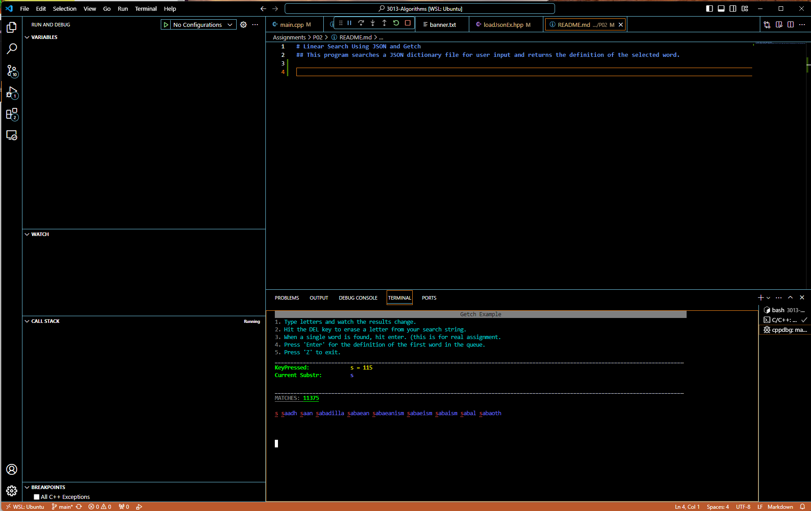
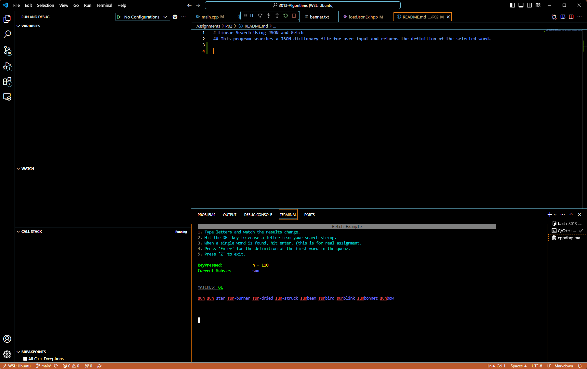
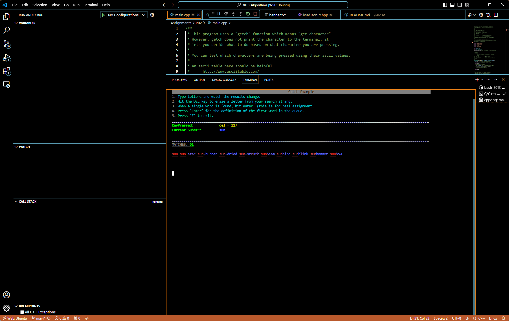
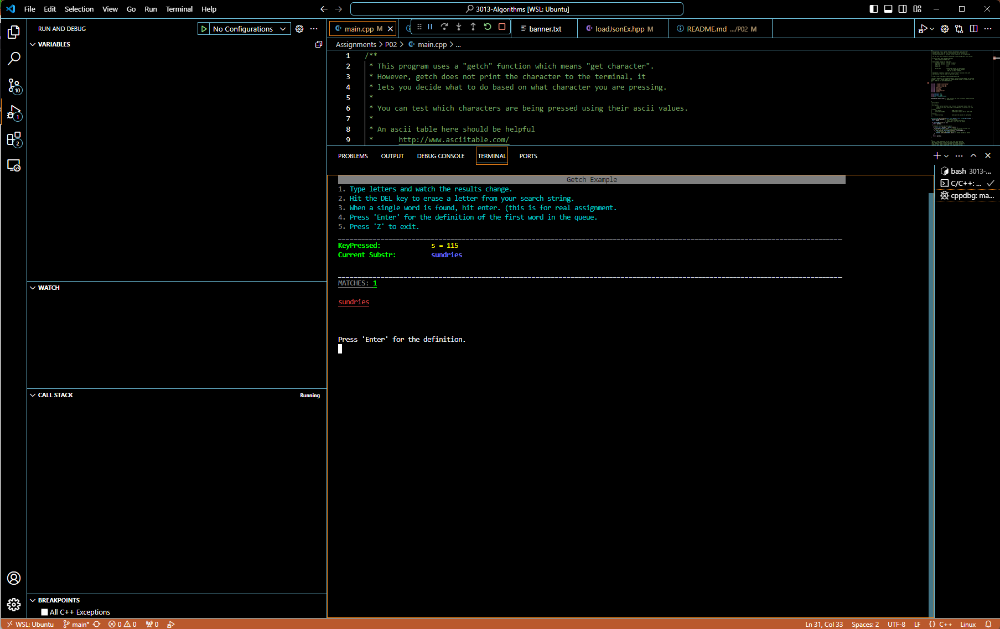
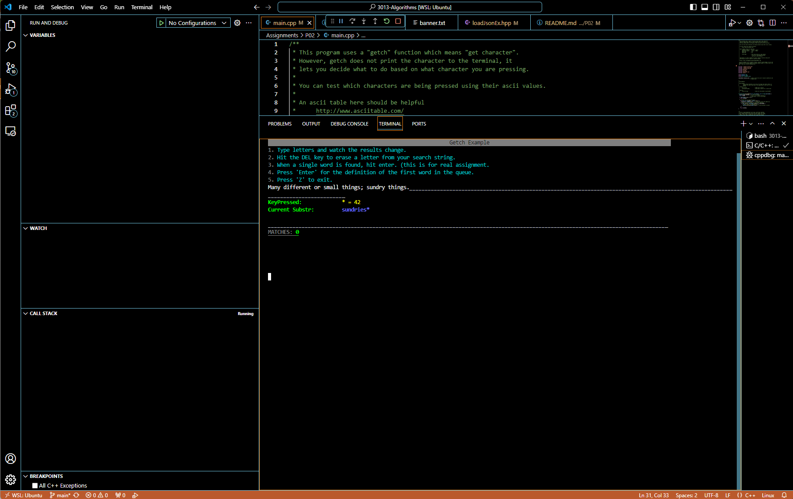
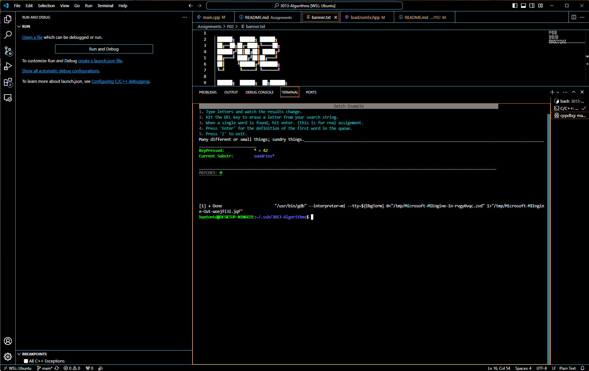

# Linear Search Using JSON and Getch
## This program searches a JSON dictionary file for user input and returns the definition of the selected word.

### Start the program and choose a word. In this example, we'll search for the word "sun".

### As you can see from the image above, as we begin typing letters, the program shows all matches beginning 
### with that letter.

### As we continue, the program continues to display the next 10 possible words in the dictionary that match
### the user input.

### If we type the 'Enter' key, the program will display the definition of the leftmost word, which matches
### the user input in this case.

### If the user backspaces, the program removes the 'Enter' input and returns to display the next 10 matching words

### If the user enters a word with only one match, they will be prompted to type 'Enter' for the definition...

### And the definition will, again, be displayed if they type 'Enter'. If the user types a capital 'Z', the
### program will exit, as seen below.

