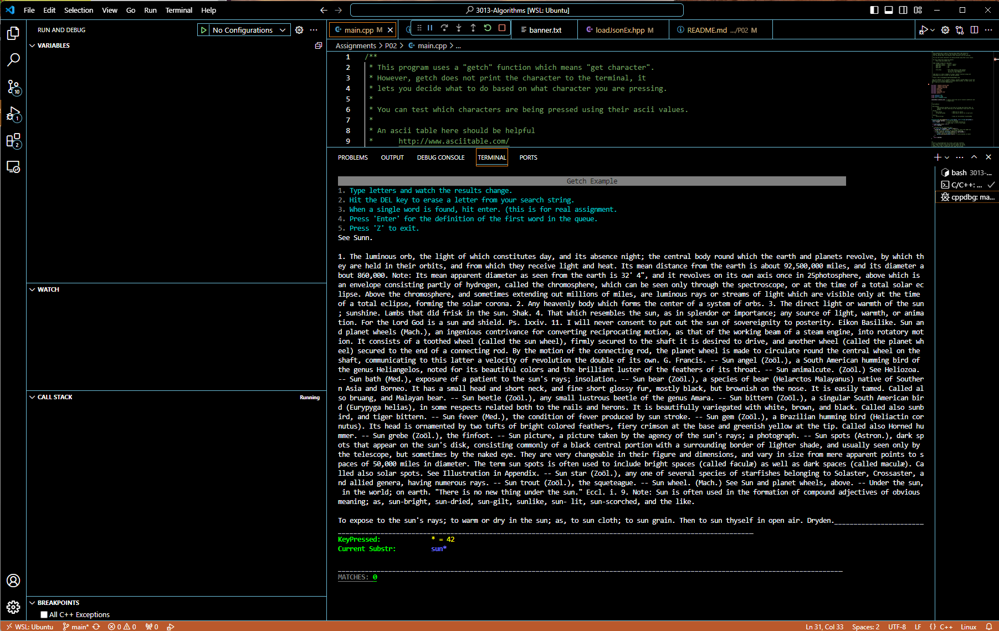

## P02 - Linear Search Using JSON and Getch
### Timothy Haxton
### Description: This program searches a JSON dictionary file for user input and returns the definition of the selected word.

### Files and Folders

|   #   | File                                    | Description                                                                  |
| :---: | --------------------------------------- | ---------------------------------------------------------------------------- |
|   1   | [main.cpp](main.cpp)                    | Main driver of my project that launches the dictionary search application    |
|   2   | [loadJsonEx.hpp](loadJsonEx.hpp)        | Loads the dictionary.json file                                               |
|   3   | [console.hpp](headers/console.hpp)      | Contains console functions and determines which libraries to use based on OS |
|   4   | [json.hpp](headers/json.hpp)            | Contains JSON functions                                                      |
|   5   | [rang.hpp](headers/rang.hpp)            | Provides a namespace for coloring test in the terminal                       |
|   6   | [dictionary.json](data/dictionary.json) | Contains dictionary file to be searched                                      |

### Instructions

- Start the program and choose a word. In this example, we'll search for the word "sun".

- As you can see from the image above, as we begin typing letters, the program shows all matches beginning with that letter.

- As we continue, the program continues to display the next 10 possible words in the dictionary that match the user input.

- If we type the 'Enter' key, the program will display the definition of the leftmost word, which matches the user input in this case.

- If the user backspaces, the program removes the 'Enter' input and returns to display the next 10 matching words

- If the user enters a word with only one match, they will be prompted to type 'Enter' for the definition...

- And the definition will, again, be displayed if they type 'Enter'. If the user types a capital 'Z', the program will exit, as seen below.

